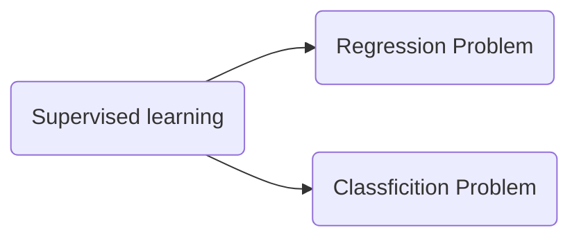
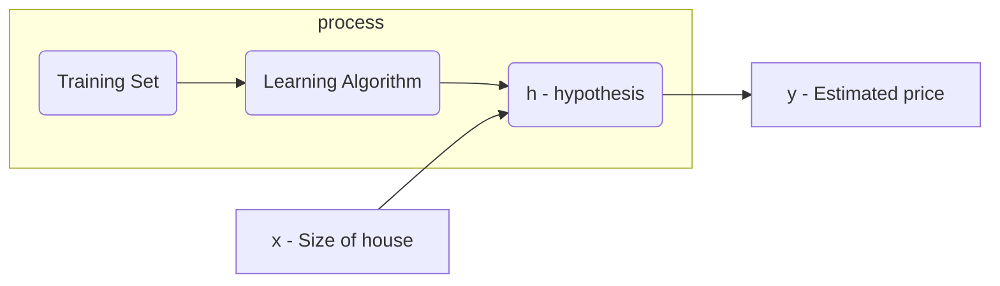

# Linear Regression

#### Model Representation

- Trainning process

​		How do we repersent h?
$$
single\; variable:\qquad h_{\theta}(x) = {\theta}_0 + {\theta}_1 \times x\\
multiple\; variables:\qquad h_{\theta}(x) = {\theta}_0 + \sum_{i=1}^{n}\theta_ix=\Theta^\mathrm{T}X\\
X=\left[\begin{matrix}x_0\\x_1\\x_1\\\vdots\\x+n\end{matrix}\right]\in \mathbb{R}^{n+1},(x_0=1)\qquad
\Theta=\left[\begin{matrix}\theta_0\\\theta_1\\\theta_1\\\vdots\\\theta+n\end{matrix}\right]\in \mathbb{R}^{n+1}\\
$$

#### Cost function

- Defniniton

  How to choose parameters?
$$
\mathop{\arg\min}_{\theta_0, \theta_1}\frac{1}{2m}\sum_{i=1}^{m}(h_{\theta}(x^{(i)}) - y^{(i)})\\

\mathop{\arg\min}_{\theta_0, \theta_1}J(\theta_0, \theta_1), where \underbrace{J(\theta_0, \theta_1)}_{cost function}=\frac{1}{2m}\sum_{i=1}^{m}(h_{\theta}(x^{(i)}) - y^{(i)})
$$
​	Find the values of $\theta_0$ and $\theta_1$ so that the expression (the average 1 over 2M times the sum of square errors between predictions on the training 	set minus the actual values ys) is minimized.

​	Squared error function  is one kind of cost function, which is probably the most commonly used one for regression problems.

|hypothesis $h_\theta(x)$| cost function $J(\theta_1)$|
|:-:|:-:|
|for fixed $\theta_1$, this is a function of x|function of the parameter $\theta_1$|

#### Gradient Descent
repeat unitl convergence{
$$
\theta_j:=\theta_j-\alpha\frac{\partial}{\partial\theta_j}J(\theta_0,\theta_1)\quad(for\;j=0\;and\;j=1)
$$
}, where $\alpha$ means learning rate.

#### Apply Gradient Decent To Linear Regression

$$
\theta_0^{(i+1)}=\theta_0^{(i)}-\frac{\alpha}{m}\sum_{i=1}^{m}(h_\theta(x^{(i)})-y^{(i)})\\
\theta_1^{(i+1)}=\theta_1^{(i)}-\frac{\alpha}{m}\sum_{i=1}^{m}(h_\theta(x^{(i)})-y^{(i)})\times x^{(i)}
$$

#### Batch gradient Decent

"Batch": Each step of gradient decent uses all the training examples.

#### Feature Scaling

Idea: Make sure features are on a similar scale

Get every feature into approximately a $-1\le x_i \le 1$ range.

#### Mean normalization

Replace $x_i$ with $x_i=\mu_i$ to make features have approximately zer mean ==(DO NOT apply to $x_0=1$)=

More generally, we can replace $x_i$ with $x_i=\frac{x_i-\mu_i}{s_i}$ , where $\mu_i$ is the average value of $x_i$ in the training set and $s_i$ is the range of values of that features (aka, the maximun value minus the minimum value) or the standard deviation of the variable.

# Polynomial Regression

# Normal Equation

 Method to solve for $\theta$ analytically
$$
\theta\in\mathbb{R}^{n+1}\qquad J(\theta_0,\theta_1,\dots,\theta_m)=\frac{1}{2m}\sum_{i=1}^m(h_\theta(x^{(i)})-y^{(i)})^2\\
\frac{\partial}{\partial\theta_j}J(\theta)=\dots=0\quad(\mathrm{for\;every\;}j)
$$
Suppose $x$ is a m*(n+1) matrix and $y$ is a m-dimensional vector
$$
\theta=(X^\mathrm{T}X)^{-1}X^\mathrm{T}y
$$

> deduce?
>
> https://blog.csdn.net/bengshakalakaka/article/details/84639560

|          Gradient Decent          |                       Normal Equation                        |
| :-------------------------------: | :----------------------------------------------------------: |
|     Needs to choose $\alpha$      |                  No need to choose $\alpha$                  |
|       Needs many iterations       |                    Don't need to iterate                     |
| Works well even when $n$ is large | Needs to compute $(X^\mathrm{T}X)^{-1}$, which is slow if $n$ is very large (roughly O($\mathrm{n^3}$)). |

usually when n is nearly 10000, we tend to use gradient decent rather than normal equation.

#### Non-invertibility

When computing $\theta=(X^\mathrm{T}X)^{-1}X^\mathrm{T}y$, what if $X^\mathrm{T}X$ is non-invertible? (singular matrices奇异矩阵\degenterate matrices退化矩阵)

> Difference between pinv() and inv()?
>
> https://www.zhihu.com/question/47688307

###### why is it non-invertible?

- Redundant features (linearly dependent)

  E.g. $x_1$=size in feet*feet

  ​		$x_2$=size in m*m

  - delete one of these features

- Too many features (e.g. $m\le n$)

  - delete some features, or use regularizaion